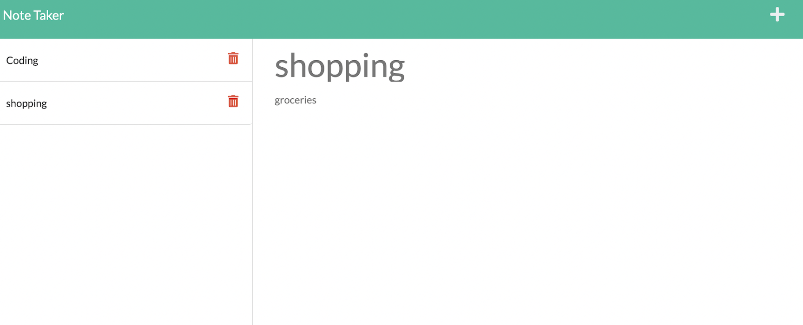

# Note-Taker-HW 

## Description

The purpose of this app is for the user to be able to create and store notes.

## Table of Contents

- [Installation](#installation)
- [Usage](#usage)
- [Assets](#assets)
- [License](#license)
- [GitHub Profile](#github-profile)
- [Contact by Email](#email)

## Installation

Run npm i to install necessary libraries.

## Usage

Enter a 'title' and a description in the 'note text' section. The note will save to the left.

## Assets

[Live Website](https://boiling-spire-25558.herokuapp.com/notes)

## License

This project is licensed with MIT.

### GitHub Profile

[My Profile](https://github.com/audrey-g37)

### Email

audrey.gillies@gmail.com
